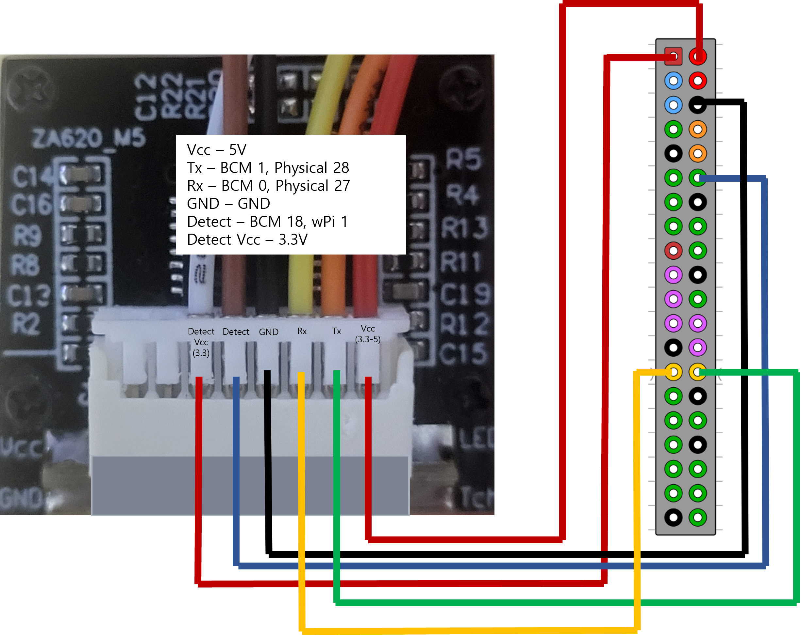
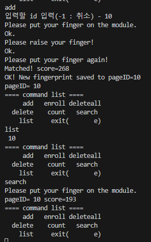

## AS608

### 개요

WiringPi와 WiringSerial을 이용하여 Serial통신으로 지문을 인식하도록 하는 코드

필요한 내용만 추가하였으니 다른 부분은 [이 리포지토리](https://github.com/Kit-doorlock/doorlock/blob/iot/AS608/example/main.c)의 `analyseArgv` 함수를 참조하길 바란다.

본인은 UART2, 즉 ttyAMA1을 사용하였다. 다른 핀을 사용하는 경우에는 핀맵이 달라질 수 있다.

wiringPiSetup()으로 초기화한 경우 wPi의 핀 번호를, wiringPiSetupGpio()로 초기화 한 경우 BCM 핀 번호를 Detect Pin 번호로 사용하면 된다.

### 핀맵



### 테스트 코드 사용법

`make` 하면 main 실행파일이 나올 것이다.   
AS608을 라즈베리파이와 연결하고 리눅스 기준 ./main 을 실행하면 된다.

실행 예제는 아래와 같다.



### 참고

Tx, Rx를 제대로 연결했는데도 인식이 안된다면 Tx, Rx 선을 바꿔보자.

전원 입력하고 모듈을 인식하는데까지 시간이 좀 걸린다. 기다리자.


BAUD_RATE는 57600 → 9600 → 115200 순으로 적용해보자. 라이브러리 제작자는 9600으로 했는데 아두이노 라이브러리를 보니 57600을 사용하였다.
```c
#define FINGER_DETECT_PIN 1 // wPi pinmap 기준
#define BAUD_RATE 57600
#define SERIAL "/dev/ttyAMA1" // 사용하려는 시리얼 드라이버로 교체
#define ADDRESS 0xffffffff // default
#define PASSWORD 0x00000000 // default
#define VERBOSE 0 // 0 : 정보 안보여줌, 1 : 정보 보여줌
#define HAS_PASSWORD 0 // 0 : 비밀번호 없음
```