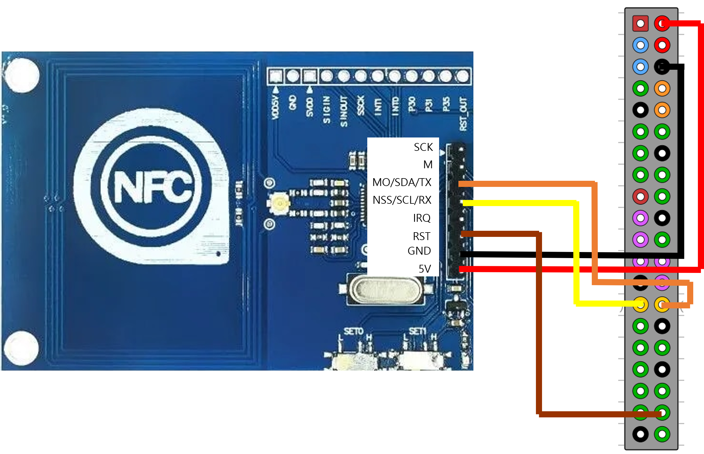
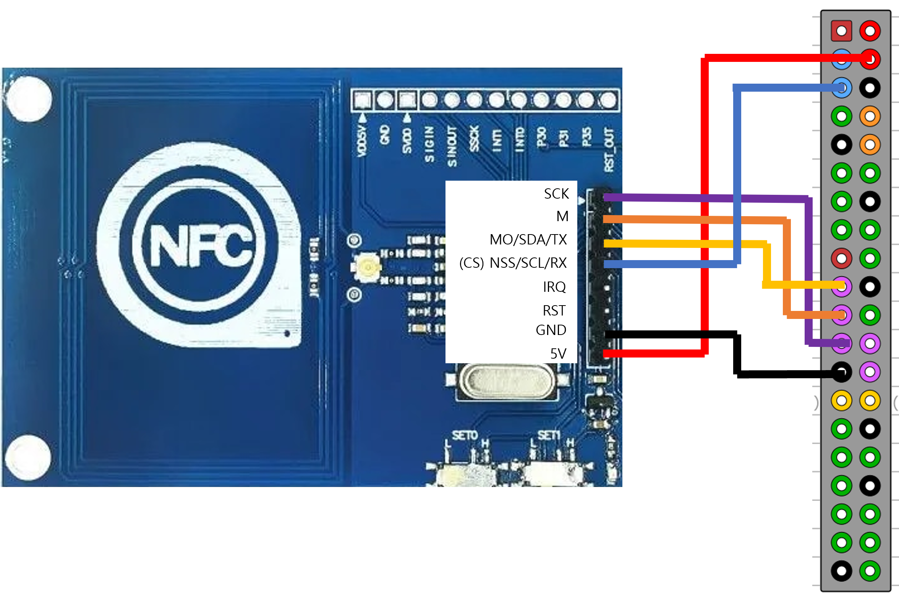
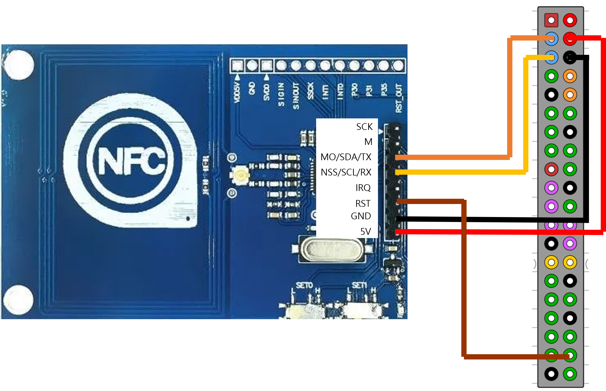

## PN532 NFC 모듈

### 개요

nfc/nfc.h를 쓰다보니 다른 라이브러리를 추가해야했다.   
다른 사람이 만들어놓은 프로젝트가 있을까 찾아봤는데 wiringPi로 만들어놓은 프로젝트가 있었다.   
너무 잘 만들어놔서 해당 프로젝트의 예제를 사용하였다.

### 핀맵

I2C, UART, SPI에 따라 다르다.   
나는 UART2(ttyAMA1)를 사용하였다. 

자세한 내용은 [이쪽](https://github.com/soonuse/pn532-lib/tree/master)을 참고 바란다.

1. UART - ttyAMA1



2. SPI



3. I2C



### 기초 세팅

1. UART   
`/boot/config.txt`에 `dtoverlay=uart2`를 맨 밑에 추가한다.

2. SPI   
2.1 config.txt 수정   
`dtparam=spi=on` 이 부분을 주석 해제한다.   
2.2 raspi-config 수정   
`Interface Options - SPI - Enable`   
<br>
이후 재부팅한다.

3. I2C   
3.1 config.txt 수정   
`dtparam=i2c=on dtparam=i2c_arm=on` 이 부분을 주석 해제한다.   
3.2 raspi-config 수정   
`Interface Options - I2C - Enable`  
<br>
이후 재부팅한다.   
`i2cdetect -y 1`으로 활성화되었는지 확인한다.

### 이 예제 사용

make 로 main 실행파일이 생성된다.   
실행 후 command는 `add`, `verify`, `delete`, `exit` 이 있다.

- add : 카드 추가
- verify : 카드가 있는지 확인
- delete : 카드 삭제


### 참고

`wiringPiSetupGpio()` 즉 BCM으로 초기화하였다. AS608과 같이 쓰기 위해서는 통일할 필요가 있다.

<br>

i2c를 활성화 할때 raspi-config에서 수정을 해도 dtparam=i2c_arm=on 이부분만 주석을 해제해줬다.   
dtparam=i2c=on 이 부분도 주석 해제해주자.   
<del>내가 이거때문에 몇시간을 해멨는지 모르겠다...</del>

<br>

그래도 안된다면 [이곳](https://velog.io/@minjichoii/%EB%9D%BC%EC%A6%88%EB%B2%A0%EB%A6%AC%ED%8C%8C%EC%9D%B4-NFC-%EB%AA%A8%EB%93%88)을 참고하자.   
요약하면 아래와 같다.
```sh
# i2ctools 설치
sudo apt-get install libusb-dev libpcsclite-dev i2c-tools
```
```sh
# nfc 라이브러리 다운로드
wget https://github.com/nfc-tools/libnfc/releases/download/libnfc-1.8.0/libnfc-1.8.0.tar.bz2 && tar -xf libnfc-*.tar.bz2
```
```sh
# nfc 라이브러리 설치
cd libnfc-1.7.1
./configure --prefix=/usr --sysconfdir=/etc
make && sudo make install
```