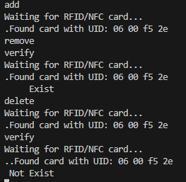

## PN532 NFC 모듈

### 개요

nfc/nfc.h를 쓰다보니 다른 라이브러리를 추가해야했다.   
다른 사람이 만들어놓은 프로젝트가 있을까 찾아봤는데 wiringPi로 만들어놓은 프로젝트가 있었다.   
너무 잘 만들어놔서 해당 프로젝트의 예제를 사용하였다.

### 핀맵

I2C, UART, SPI에 따라 다르다.   
나는 UART2(ttyAMA1)를 사용하였다. 

자세한 내용은 [이쪽](https://github.com/soonuse/pn532-lib/tree/master)을 참고 바란다.

### 이 예제 사용

make 로 main 실행파일이 생성된다.   
실행 후 command는 `add`, `verify`, `delete`, `exit` 이 있다.

- add : 카드 추가
- verify : 카드가 있는지 확인
- delete : 카드 삭제

### 참고

`wiringPiSetupGpio()` 즉 BCM으로 초기화하였다. AS608과 같이 쓰기 위해서는 통일할 필요가 있다.